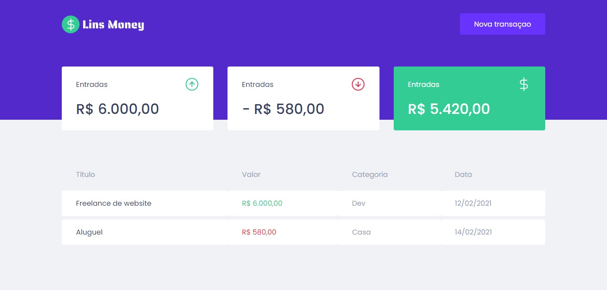
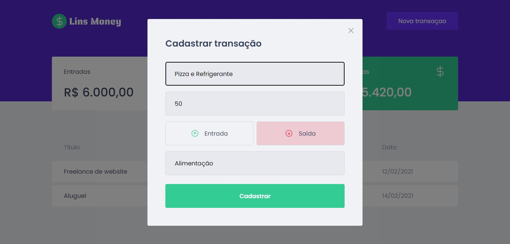
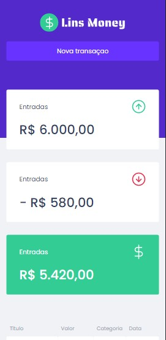
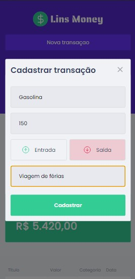
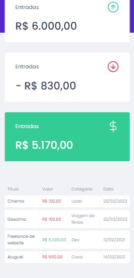

<h1 align="center">
  
  Uma aplicação web responsiva para controle financeiro usando React JS com Typescript
</h1>

<h2 align="center">Tabela de Conteúdos</h2>

  • <a href="#sobre">Sobre</a>
  • <a href="#funcionalidades">Funcionalidades</a>
  • <a href="#layout">Layout</a>
  • <a href="#tecnologias">Tecnologias</a> 
  • <a href="#status">Status do Projeto</a> 
  • <a href="#autor">Autor</a>
  • <a href="#licenca">Licença</a>

<h2 align="center" id="sobre">Sobre</h2>

Uma aplicação web de controle financeiro, onde o usuário pode ter acesso de todas as suas transações de entradas e saídas registradas sendo exibidas na tela inicial, a aplicação é super simples de usar, com funcinalidades que ajudam a ter uma melhor organização das finanças.

<h3 align="left" id="funcionalidades">Funcionalidades</h3>

- [x] Adicionar uma transação de entrada ou saída, por categoria;
- [x] Acompanhar a listagem de transações de entradas e saídas;
- [x] Fazer login na conta Google; (em construção)
- [x] Excluir uma transação de entrada ou saída; (em construção)
- [x] Fazer logout; (em construção)

<h2 align="left" id="layout">🎨 Layout</h2>

O layout da aplicação está disponível no Figma:

<h3 align="left" id="layout">Versao Web e responsível</h3>

  
  

  
  
    

<h3 align="left" id="tecnologias">🛠 Tecnologias</h3>

As seguintes Tecnologias e bibliotecas que foram usadas na construção do projeto

- [Node.js](https://nodejs.org/en/)
- [ReactJS](https://pt-br.reactjs.org/)
- [TypeScript](https://www.typescriptlang.org/)
- [Styled-components](https://styled-components.com/docs/basics)
- [React-modal](https://github.com/reactjs/react-modal)
- [MirageJS](https://miragejs.com/tutorial/intro/)
- [Axios](https://axios-http.com/docs/intro)

<h2 align="left" id="status">Status do Projeto</h2>

 🚧  ReactJS 🚀 Versão 1.0 em Construção.  🚧.

<h2 align="left" id="autor">🦸 Autor</h2>
<a href="https://github.com/JailsonSantos">
 
  
 <b>Jailson Santos</b></a> <a href="https://www.linkedin.com/in/jailson-santos-726395104/" title="Jailson Santos">🚀</a>
  

 

<h2 align="left" id="licenca">📝 Licença</h2>

Este projeto esta sobe a licença [MIT](./LICENSE).

Feito com ❤️ por Jailson Santos 👋🏽 [Entre em contato!](https://www.linkedin.com/in/jailson-santos-726395104/)